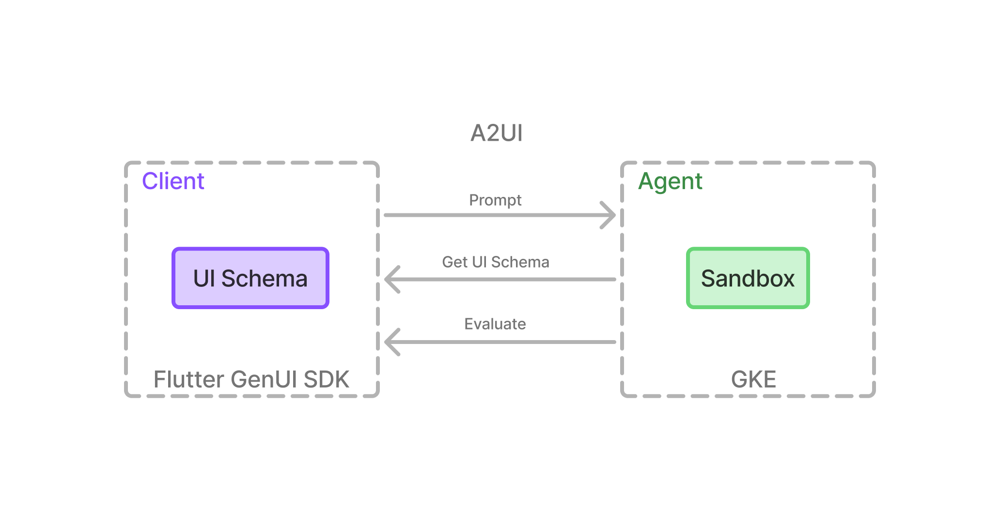
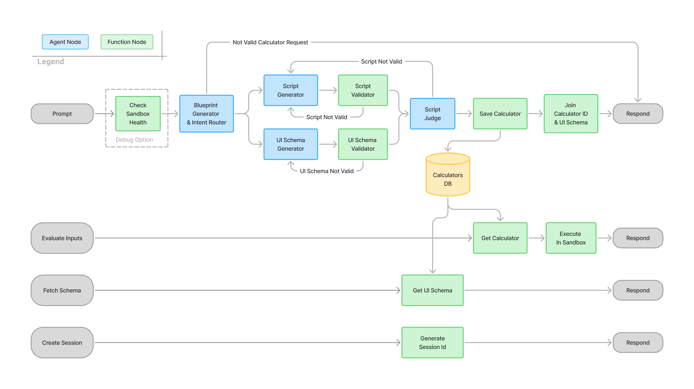

# Manyculator Agent
### Build custom calculators and converters — from a single sentence.

*Manyculator turns a plain-language request — "I need a room paint quantity calculator" — into a working, ready-to-use calculator in minutes: sandboxed, cross-platform, and safe by design.*

---

## Table of Contents
- [Overview](#overview)
- [Architecture & Workflow](#architecture--workflow)
  - [Architecture Decisions](#architecture-decisions)
  - [System Workflow](#system-workflow)
- [Authentication (Application Default Credentials)](#authentication-application-default-credentials)
- [Database Setup](#database-setup)
  - [Option A: Firestore (Default)](#option-a-firestore-default)
  - [Option B: Local JSON File (Testing)](#option-b-local-json-file-testing)
- [Configuration](#configuration)
  - [Model Selection](#model-selection)
  - [Development Options](#development-options)
- [Getting Started (Local Development)](#getting-started-local-development)
  - [Prerequisites](#prerequisites)
  - [Setup](#setup)
- [Deployment (GKE / Google Cloud Platform)](#deployment-gke--google-cloud-platform)
  - [Prerequisites](#prerequisites-1)
  - [Instructions](#instructions)
- [Client Integration](#client-integration)

## Overview
The `manyculator-agent` is the core backend component responsible for generating custom interactive calculators based on natural language user intent. It leverages a graph-based workflow architecture powered by Google ADK to orchestrate LLM calls for intent analysis, live value resolution, Python script generation, and UI schema generation.

A defining feature of this agent is its strict **Sandbox Execution** and **A2UI-compliant** output. The architecture isolates script validation using deterministic structural checks before applying a reasoning LLM Judge to verify intent alignment. The generated output is instantly renderable by any standard A2UI frontend.

---

## Architecture & Workflow

### Architecture Decisions
The central architectural principle of this project is **decoupling UI and logic via A2UI & sandboxing**.

Since building calculators requires dynamic Python script generation, the UI is decoupled from the execution logic using the A2UI protocol. This ensures untrusted scripts run in an isolated sandbox, fully protecting the consumer application. Furthermore, because the computation script is stored on the backend, the same calculator instance can seamlessly power cross-platform UIs (Web, iOS, Android).



**Other decisions:**

- **Abstracting the Agentic System**:
  The workflow is designed to remain completely agnostic of consumer app implementations. This strict separation of concerns allows the agentic system (which requires specialized infrastructure like GKE and sandboxing) to scale independently from the frontend clients.
- **Asynchronous Streaming (SSE)**:
  Agentic loops can take significant time. Exposing the agent execution via Server-Sent Events (SSE) prevents HTTP timeouts and allows consumer apps to show real-time progress. *(Note: While real-time status updates are not fully implemented in the current version, the SSE foundation makes them trivial to add.)*
- **GKE for Deployment**:
  Google Kubernetes Engine (GKE) was selected because it offers native integration with the ADK ecosystem and provides advanced, ephemeral sandboxing. Every time a script is evaluated, GKE spins up an isolated, single-use Pod (leveraging gVisor) to run the untrusted code, immediately destroying it afterward.
- **Firestore for Database**:
  Google Cloud Firestore was chosen for its native handling of highly dynamic JSON (perfect for storing the unpredictable A2UI schema), its zero-friction integration with Pydantic (allowing simple `.model_dump()` writes), and its seamless native authentication within the Google Cloud ecosystem.

### System Workflow

At its core, the system orchestrates 4 autonomous LLM agents—handling planning, coding, and judging—alongside rigid function nodes for security and storage.



Step-by-step breakdown of the agentic workflow:

- **Check Sandbox Health** *(Function Node, Debug Only)*: Runs a simple Python script in the sandbox on startup to verify the execution environment is healthy.
- **Blueprint Generator & Intent Router** *(Agent Node)*: Creates a structured blueprint from the user's intent. This serves as the single source of truth for the rest of the workflow, defining parameters, computation logic, and edge cases. It also acts as an intent router — if the prompt is not related to building a calculator, it halts the workflow and returns an error.
- **Script Generator & UI Schema Generator** *(Agent Nodes)*: These run in parallel, generating their respective outputs based on the shared blueprint.
- **Script Validator & UI Schema Validator** *(Function Nodes)*: These run deterministic checks *before* any LLM judgment. The Script Validator uses the sandbox to catch syntax errors, while the UI Schema Validator validates the JSON structure against the A2UI SDK. Failing fast deterministically saves expensive LLM tokens and latency.
- **Script Judge** *(Agent Node)*: Evaluates if the generated Python script correctly handles the exact data shapes and component IDs defined in the UI schema. It acts as the final gatekeeper to ensure front-to-back compatibility.
- **Save Calculator** *(Function Node)*: Saves the finalized calculator script and UI schema to the database.
- **Join Calculator ID & UI Schema** *(Function Node)*: Constructs the final JSON payload containing the new Calculator ID and Schema.

**External API Endpoints**:
- **Evaluate Inputs** (`POST /evaluate/{id}`): Retrieves the calculator script, injects the user's inputs, executes it securely in the GKE sandbox, and returns the computed result.
- **Fetch Schema** (`GET /schema/{id}`): Retrieves the A2UI schema for a specific calculator from Firestore.
- **Create Session** (`POST /sessions`): Generates and returns a unique session ID, natively provided by the ADK framework.

---

## Authentication (Application Default Credentials)

This project (including local development, Firestore database connections, and Vertex AI LLM routing) relies universally on **Application Default Credentials (ADC)**. This architecture ensures you do not need to manage raw API keys or service account JSON files across different environments.

> [!IMPORTANT]  
> **Active Billing Required**: You must have a Google Cloud Project with an active billing account. This is strictly required for Vertex AI LLMs, creating Firestore databases, and deploying GKE infrastructure.

**To set up ADC locally:**
1. Install the [Google Cloud CLI](https://cloud.google.com/sdk/docs/install) (`gcloud`).
2. Initialize and authenticate with your Google account:
   ```bash
   gcloud auth application-default login
   ```
3. Set your active project (the one containing your Firestore DB and Vertex AI API quota):
   ```bash
   gcloud config set project YOUR_PROJECT_ID
   ```
*Note: When deployed to Google Cloud (e.g., GKE or Cloud Run), ADC is provided automatically by the attached compute Service Account, requiring zero key configuration.*

---

## Database Setup

The agent persists all generated calculator scripts and UI schemas to a database so they can be retrieved and executed by the frontend. You can choose between Google Cloud Firestore (default for production) or a local JSON file for quick local testing.

### Option A: Firestore (Default)
1. **Enable Firestore API** in your Google Cloud Project.
2. **Create a Named Database**:
   * Go to the Firestore console in GCP.
   * Click **Create Database**.
   * Set the **Database ID** strictly to `calculators` (the codebase specifically routes to this named database, *not* the `(default)` database).
   * Choose **Native mode** and select your preferred region.
3. **Authentication**: The backend connects automatically using ADC. As long as you have completed the `gcloud auth application-default login` step above and your Google user has Firestore read/write permissions, the connection will succeed without extra configuration.

### Option B: Local JSON File (Testing)
If you want to bypass Google Cloud entirely for local development, you can swap the database layer to write to a local `calculators_db.json` file.
1. Navigate to the `app/` directory.
2. Backup the existing Firestore store:
   `mv calculator_store.py calculator_store.py.backup`
3. Swap the files by renaming the local version:
   `mv calculator_store_local.py calculator_store.py`

---

## Configuration

Core agent configuration is managed within [`app/config.py`](app/config.py). 

### Model Selection
The agent isolates its LLM routing based on the specific task type:
*   **`model_reasoning`**: Used by the Blueprint Generator node.
*   **`model_coding`**: Used by the Script Generator and UI Schema Generator nodes.
*   **`model_script_judge`**: Used by the Script Judge node.

*Note: You can swap these defaults for third-party models (e.g., Claude, DeepSeek) using the `LiteLlm` wrapper, as documented in the configuration file.*

### Development Options
You can toggle the following operational behaviors inside the `LocalConfig` and `GkeConfig` blocks:
*   **`check_sandbox_on_start`**: A debug flag that verifies the sandbox execution environment is healthy by running a minimal script (`print('ok')`) before starting any agent workflow.
*   **`sandbox_bypass_gvisor`**: When deploying to GKE, setting this to `True` disables the strict gVisor runtime class requirement. This is useful for bypassing GCE quota limitations that prevent spinning up N2/N2D instances in certain regions.

---

## Getting Started (Local Development)

### Prerequisites
*   **Python 3.11+** and the **`uv`** package manager.
*   **Google Cloud credentials** configured via [Application Default Credentials (ADC)](#authentication-application-default-credentials).
*   **Database** created and configured for Firestore, OR switched to local JSON storage (see [Database Setup](#database-setup)).

### Setup
1. Clone the repository and navigate into it.
2. Install dependencies using `uv`:
   ```bash
   uv sync
   ```
3. Configure Environment Variables:
   * Copy the example configuration: `cp .env.example .env`
   * Open `.env` and configure your GCP variables (`GOOGLE_CLOUD_PROJECT`, `GOOGLE_CLOUD_LOCATION`). The `google-genai` SDK will automatically route requests through the ADC you set up earlier.

4. Start the FastAPI server:
   ```bash
   uv run uvicorn app.fast_api_app:app --reload --host 0.0.0.0 --port 8000
   ```
5. Access the API and Playground:
   * The core agent API is now running and accessible at `http://127.0.0.1:8000/`.
   * **Interactive Playground**: You can instantly chat with the agent and test the UI by visiting the built-in playground at `http://127.0.0.1:8000/dev-ui/?app=app`. 
     * *Note:* Because the `web=True` flag is preset in `app/fast_api_app.py`, you do **not** need to run the `agents-cli playground` command explicitly; the dev-ui is bundled directly into the FastAPI server.
     * *Note:* To use the dev-ui playground correctly, ensure you have the `google-agents-cli` installed globally. If you haven't installed it yet, run: `uv tool install google-agents-cli`.

---

## Deployment (GKE / Google Cloud Platform)

### Prerequisites
*   **Google Cloud credentials** configured via [Application Default Credentials (ADC)](#authentication-application-default-credentials).
*   The `agents-cli` installed globally (`uv tool install google-agents-cli`).
*   **Database** created and configured for Firestore (see [Database Setup](#database-setup)).

### Instructions
Because this project is heavily scaffolded using the ADK framework, everything is completely **Terraform configured**. This includes the GKE cluster, Artifact Registry, Storage Buckets, and all necessary IAM permissions and Service Accounts. All infrastructure and resources will be automatically created with the base name `calc-agent` on GKE.

To deploy the entire stack from scratch to a new GCP project, simply run:
```bash
agents-cli deploy --update-env-vars "ENVIRONMENT=gke" --no-confirm-project
```

*   The `--update-env-vars "ENVIRONMENT=gke"` flag is critical: it tells the backend application to switch the variables in `app/config.py` over to the `GkeConfig` mode (which enforces strict GKE sandboxing for code evaluation).

> **Note on Public Endpoints**: For demonstration purposes, this project's Terraform configuration creates a publicly accessible endpoint on the internet. If you want to lock this down, you must open `deployment/terraform/single-project/service.tf` and uncomment the line `"cloud.google.com/load-balancer-type" = "Internal"`. This will restrict traffic to your internal VPC.

---

## Client Integration

The API provides four primary endpoints for frontends and external clients to build, retrieve, and execute dynamic calculators:

1. **Create Session** (`POST /apps/app/users/{user_id}/sessions`)
   Establishes a user session to track context before triggering the AI agent.
2. **Call the Agent** (`POST /run_sse`)
   Triggers the agent's calculator generation pipeline and returns a Server-Sent Events (SSE) stream to report real-time progress.
3. **Retrieve Schema** (`GET /schema/{calculator_id}`)
   Fetches the declarative A2UI layout and validation rules for a previously generated calculator.
4. **Evaluate Inputs** (`POST /evaluate/{calculator_id}`)
   Submits user form inputs to execute the generated calculator's Python logic securely in the sandbox and returns the math results.

For comprehensive payload examples and exact SSE format specifications, please refer to the complete **[Client Integration Guide](specs/client_integration.md)**.

---
