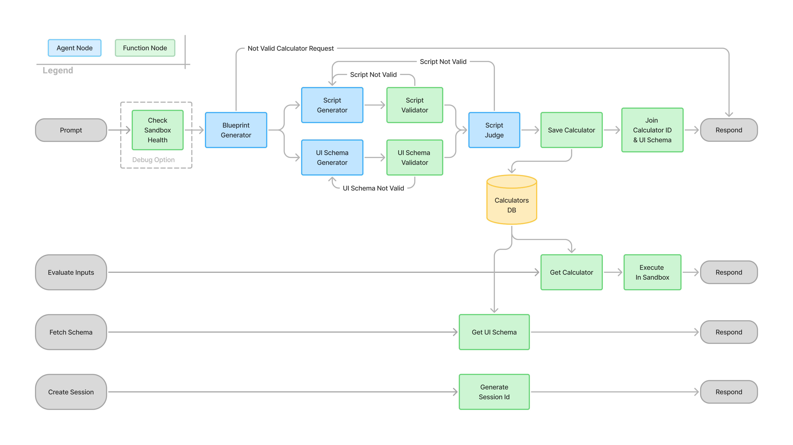

.env:
GOOGLE_CLOUD_LOCATION=global

Deployment:
- public: # "cloud.google.com/load-balancer-type" = "Internal" (in service.tf)

agents-cli deploy --update-env-vars "ENVIRONMENT=gke" --no-confirm-project
// #   --secrets "OPENROUTER_API_KEY=my-openrouter-secret"

code is syntactically valid Python and contains the required calculate function. 

---
To make the GKE service publicly available, you need to comment out the cloud.google.com/load-balancer-type annotation in your Terraform configuration.

Here is the exact line and file:

deployment/terraform/single-project/service.tf

hcl

    annotations = {
      # This annotation forces the GKE service to be accessible only within the VPC.
      # When disabled (commented out), it provisions an External TCP Load Balancer, exposing a public endpoint.
      # "cloud.google.com/load-balancer-type" = "Internal"
    }
It looks like the line is actually already commented out in your current file (Line 148). When deployed like this, it will provision an External TCP Load Balancer and be publicly accessible over the internet!

Infrastructure Provisioning (Terraform): It automatically detects your deployment/terraform/single-project/ directory and runs Terraform. This spins up the entire foundation from scratch, including:
The GKE Autopilot Cluster
Artifact Registry (for Docker images)
Custom Service Accounts & IAM bindings
Network rules (VPC, Cloud NAT, etc.)
Container Build: Once the infrastructure is ready, it uses Cloud Build to package your Python code into a production Docker image.
Registry Push: It pushes that image to the newly created Artifact Registry.
Kubernetes Rollout: Finally, it applies the Kubernetes manifests to your fresh GKE cluster, spinning up the pods with the new image and your injected ENVIRONMENT=gke environment variable.
What you would need for a fresh deployment:
If you ever want to stand this up in a brand new GCP environment, you only need three things:

A new Google Cloud Project with an active billing account.
Authenticate your terminal to the new project: gcloud auth application-default login gcloud config set project YOUR_NEW_PROJECT_ID
Run your exact command: agents-cli deploy --update-env-vars "ENVIRONMENT=gke" --no-confirm-project

agents-cli-manifest.yaml: Look at line 1, it explicitly sets name: calc-agent.
pyproject.toml: Your Python package is named calc_agent (which is automatically converted to hyphens for Google Cloud resources).
Terraform Variables (deployment/terraform/single-project/variables.tf): The project_name variable has a default value of "calc-agent".